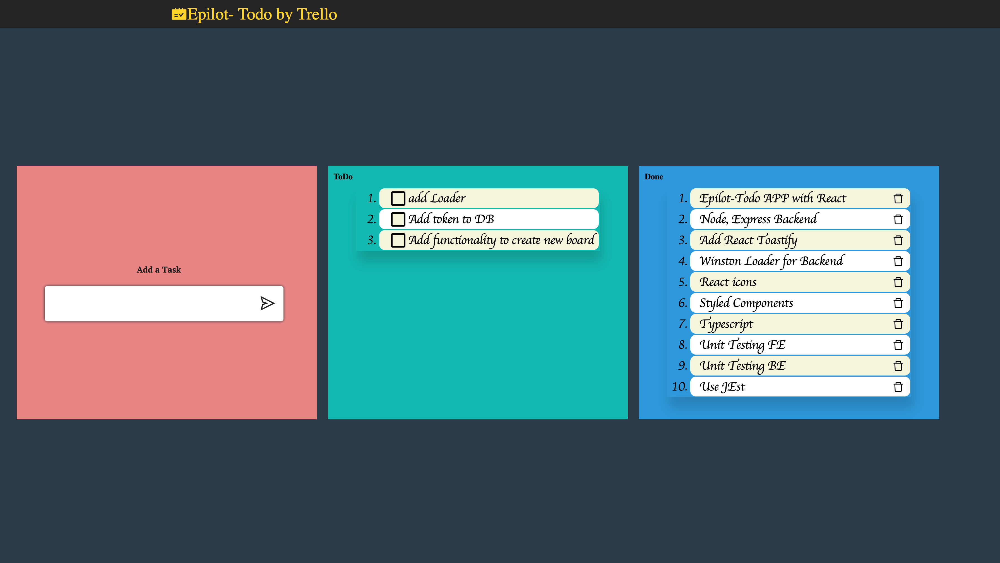

# Todo APP

Todo app on node and react using trello

## Description
This project contains two folders.
  - **backend** : Which contains server side implementation for Todo app. The app is based on 
    Node Js with Express Js to helps manage server and routes.The Server implementation
    connects with Trello Api's over a oauth 1.0 authentication mechanism. The Task thereby
    created on this app will get store on Trello workspace.
    Currently, the app uses public created Board with name - *Epilot-Todo* which have two lists
    *Todo List* and *Done List*. The board is currently being shared with my credentials, in order to use
    the app there are two ways
    * 1. Use Existing credentials present in appConfig.js file, for that you need to be added to
      as a contributor to the board.So, ping me the email id, and I will add you.
    * 2. Create your own Board and add *appKey*, *appSecret* and *boardName* from Trello in the appConfig.js file.
    
  
  After configuring Trello, go to backend folder ( cd backend )
  install the dependencies with 
  
  *npm install* and 
    
  run via *npm start* . - the BE will run at port 3000.
    
  for more details about backend project refer to
  
[Backend project ReadMe.md file](/backend/ReadMe.md)
    
  - **frontend** : Which contains the front end part of the Todo Web page.
      The FrontEnd part leverages React ~18, TypeScript and Webpack along with StyledComponents
    Simple, UI with three column flex grid, and react-toastify for notification.
    The UI is rendered with List details from Trello via the backend API's. 
    Currenlty, for simplicity purpose no state management framework like Redux/flux are used.
    
    In order to run FE app, go to frontend folder ( cd frontend )

  and install dependencies - *npm install*
  
  then run using *npm start*.
  
  for more details about front end project refer to
  
  [FrontEnd project ReadMe.md file](/frontend/ReadMe.md)

Test reports can be found in individual folders under __tests__ directory.

  

