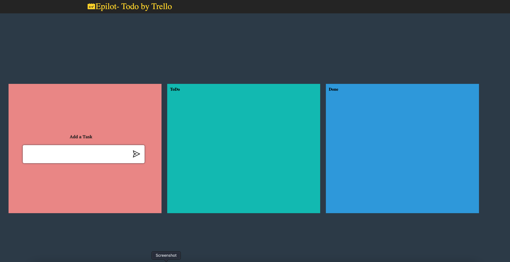
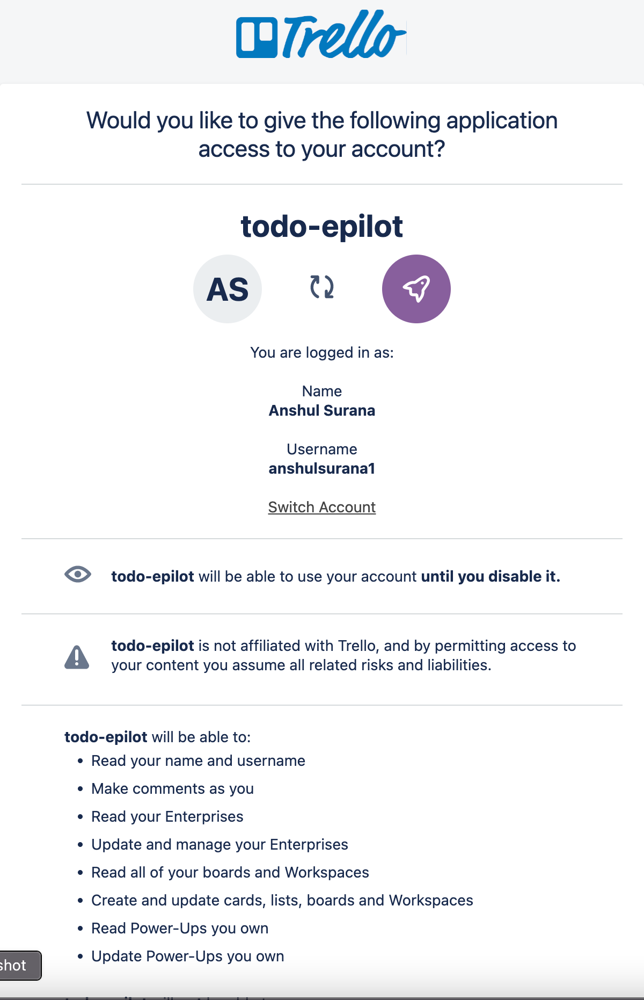
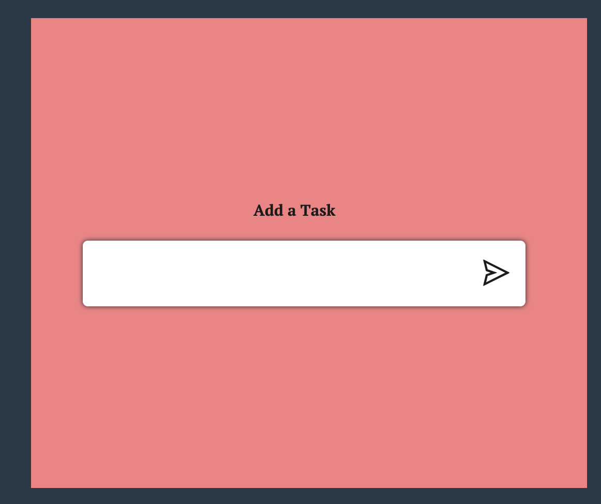
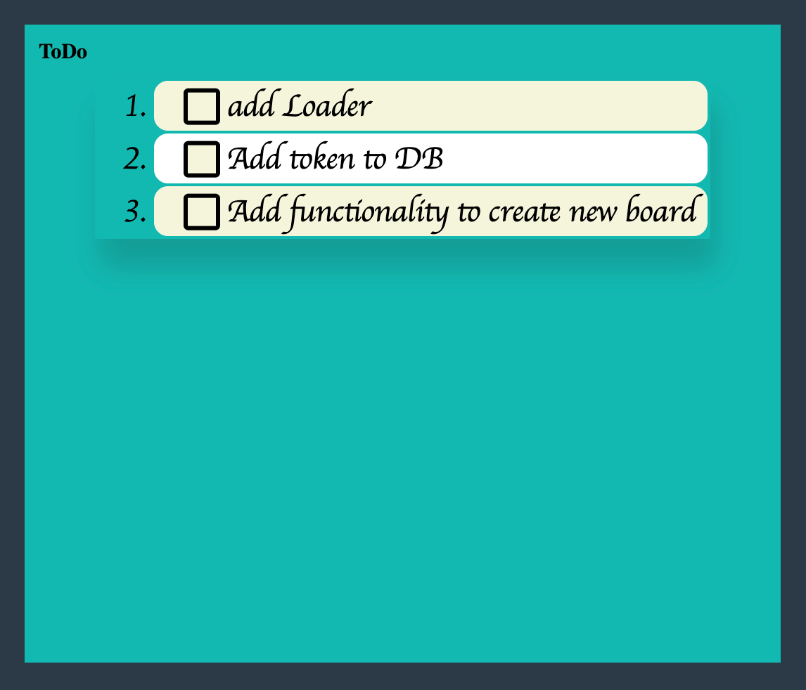
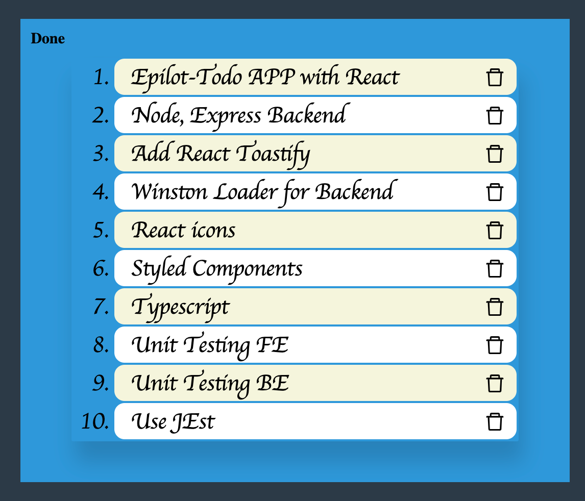

# Todo Trello App - Front End

This is Front end application for Epilot Todo app. This is a single page application that
has an input field to add new task and 2 lists namely Todo List and Done List.

##Github
https://github.com/AnshulSurana/Todo.git

## Author
Anshul Surana - surana.anshul@gmail.com

#Prerequisites
- Node >= 18
- NPM >= 8

## Reference Documentation
- React - https://reactjs.org/docs/getting-started.html
- Styled Component - https://styled-components.com/docs
- Webpack - https://webpack.js.org/
- and https://developer.mozilla.org/en-US/

## Building and Running
    npm install
    npm start

Web page at - http://localhost:8080/home
## Unit Tests
    npm run test

The Test report is present in __tests__ test-report.html file which can be viewed in browser.

# Flow Description

The front end app is created with React js, Styled Components, and Webpack .
It is a single web page launch at - *http://localhost:8080/home* with flex grid divided into three columns
column one have an input element to add a New Task in Todo App.
second Column have Todo List and third have Done List.

On Load the HeaderComponent calls Login api *'/login'*
which redirects it to Trello page to login once you allow the page redirects back to
Home page. 
*Currently, the token is being stored as global variable in app memory, the ideal way is to add in DB.*

* To Add a new Task - Simply type task name in Input field and either press *'ENTER'8 key or click on *send* icon
  
* To Move Task to Done - Click on the *Check box* next to the task.
  
* To Delete the Done Task - Click on the *Delete icon* next to task
  
